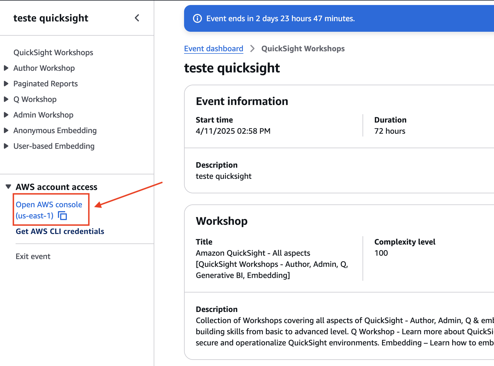
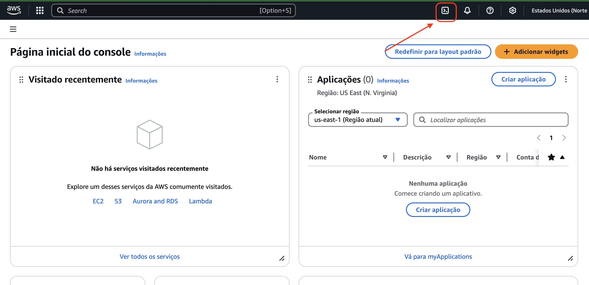
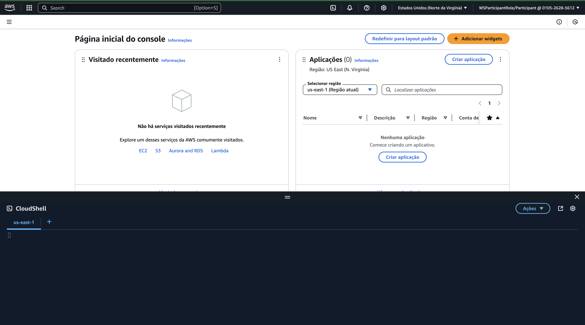
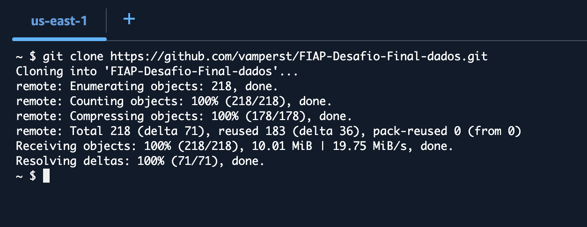
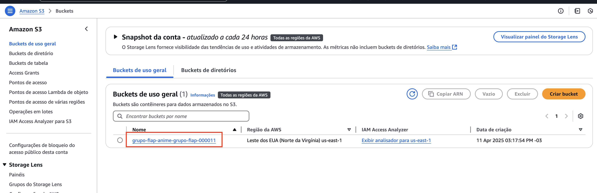
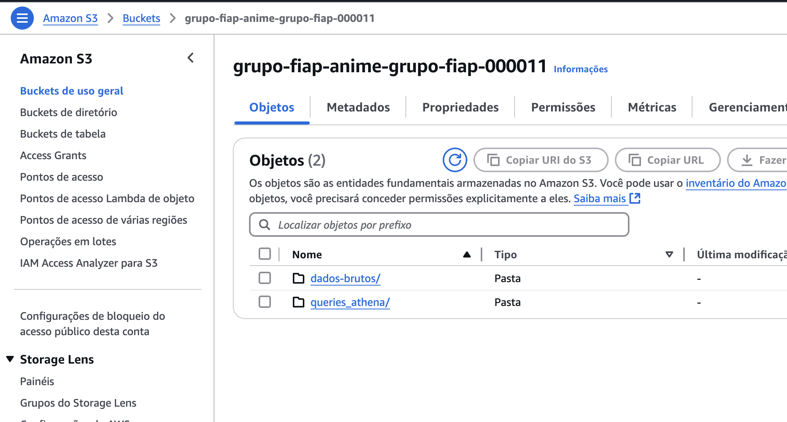
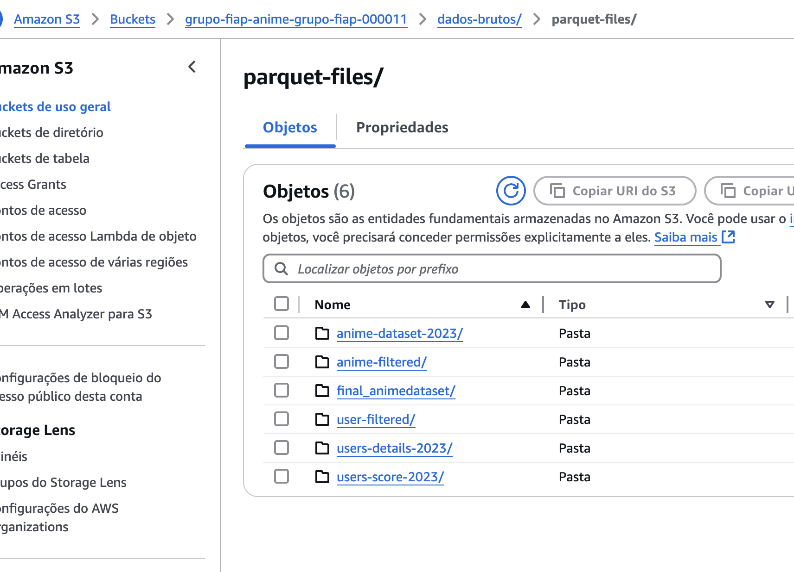
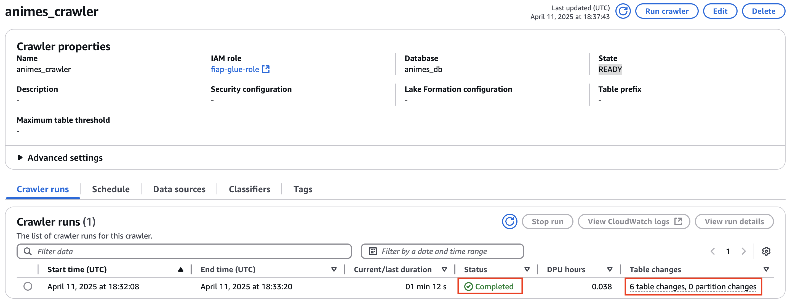
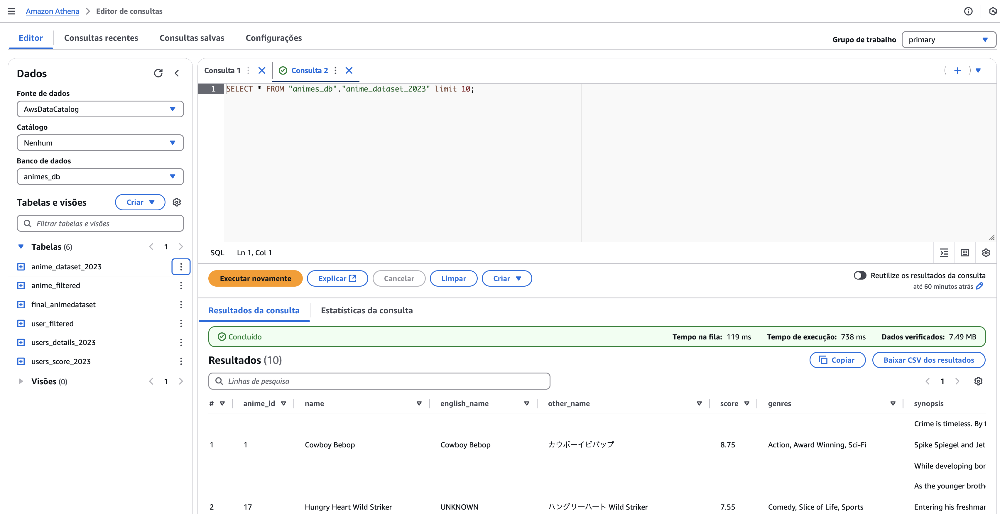

# Executando o `script.sh` no AWS CloudShell

Siga os passos abaixo para executar o `script.sh` utilizando o AWS CloudShell:

1. **Acessando a conta da AWS**  
    Clique em **Open AWS Console** na lateral esquerda da página.

    

2. **Abrindo o AWS CloudShell**
    Clique no ícone do AWS CloudShell na parte superior direita da tela.

    

    

3. **Clone o repositório**  
    No terminal do AWS CloudShell, clone o repositório contendo o script:
    ```bash
    git clone https://github.com/vamperst/FIAP-Desafio-Final-dados.git
    ```
    

4. **Navegue até a pasta do script**  
    Acesse o diretório onde o `script.sh` está localizado:
    ```bash
    cd /home/cloudshell-user/FIAP-Desafio-Final-dados/01-disponibilizando-os-dados
    ```

5. **Execute o script**  
    Execute o script com o comando. **Não esqueça** de substituir `NOME_UNICO_DO_GRUPO` pelo nome único do seu grupo:
    ```bash
    bash script.sh NOME_UNICO_DO_GRUPO
    ```

6. **Aguarde a execução**  
    O script pode levar alguns minutos para ser concluído. Aguarde até que ele termine.

7. **Verifique os resultados**
    1. Verifique primeiro o S3 criado se tem todos os arquivos necessários. Para isso acesse o [S3](https://s3.console.aws.amazon.com/s3/home) e clique no bucket criado pelo script. Note que o nome do bucket é o que termina com o nome do grupo.
    
    

    
    
    

    2. Verifique se o Glue Crawler rodou com sucesso. Para isso acesse o [Glue crawler](https://us-east-1.console.aws.amazon.com/glue/home?region=us-east-1#/v2/data-catalog/crawlers/view/animes_crawler).
    

8. **Navegue nos dados do athena**  
    Acesse o [Athena](https://us-east-1.console.aws.amazon.com/athena/home?region=us-east-1#query) e clique em `Query Editor`. Depois clique em `Set up a query result location in Amazon S3` e coloque o bucket criado pelo script. O nome do bucket é o que termina com o nome do grupo.
    
    
