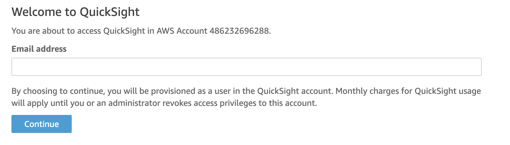
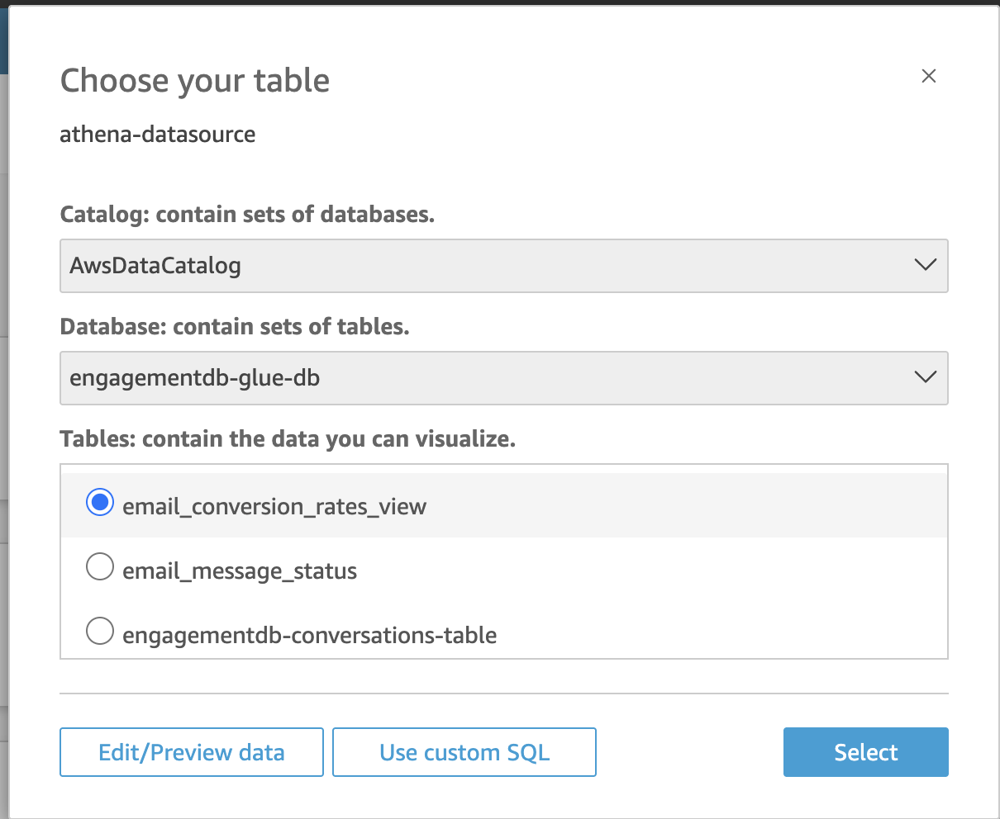
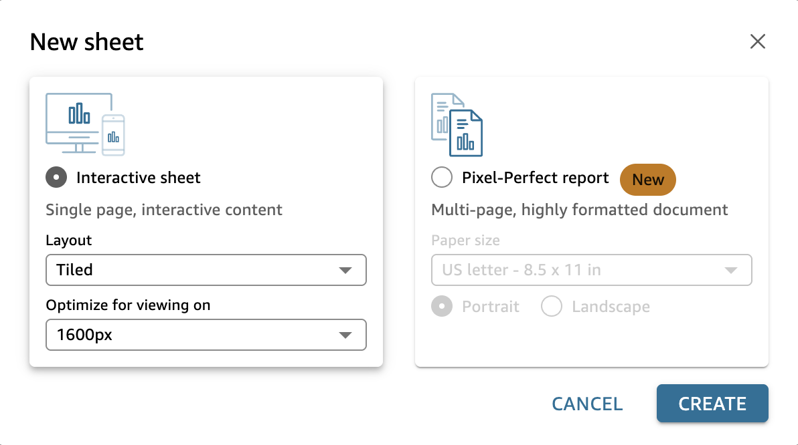
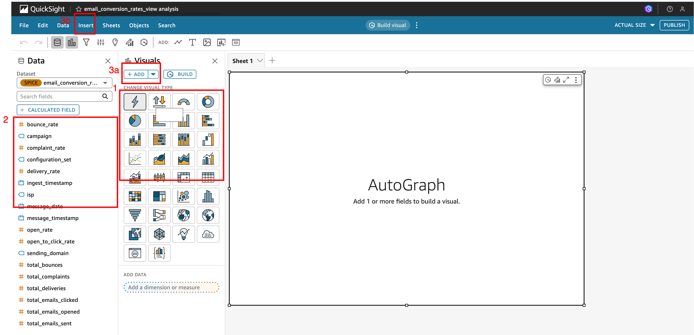
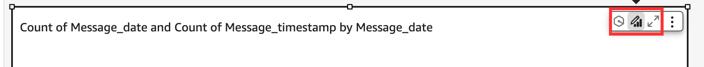
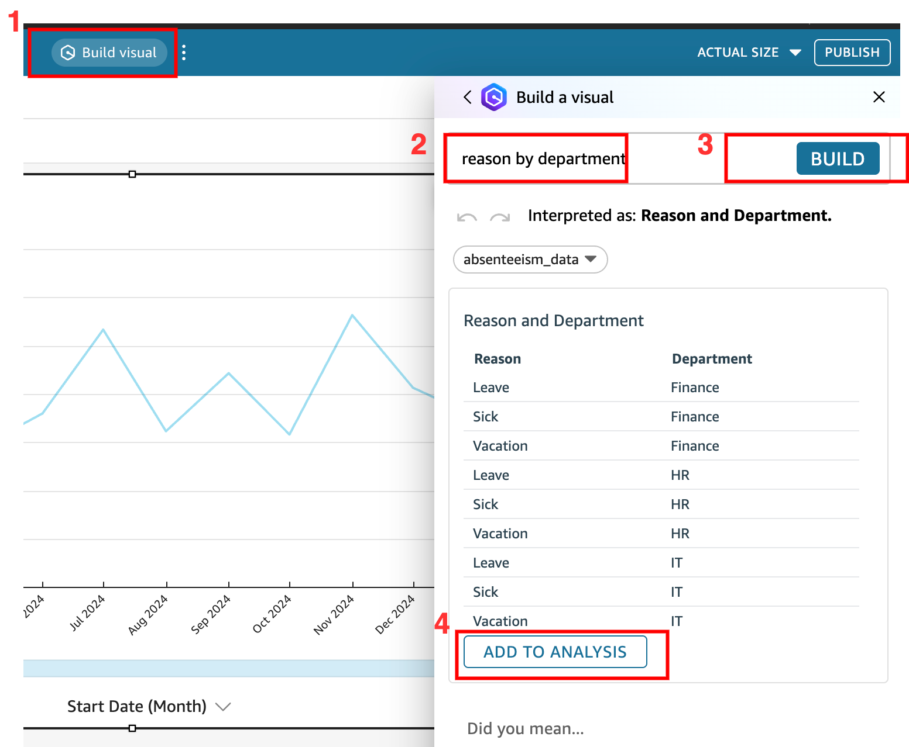
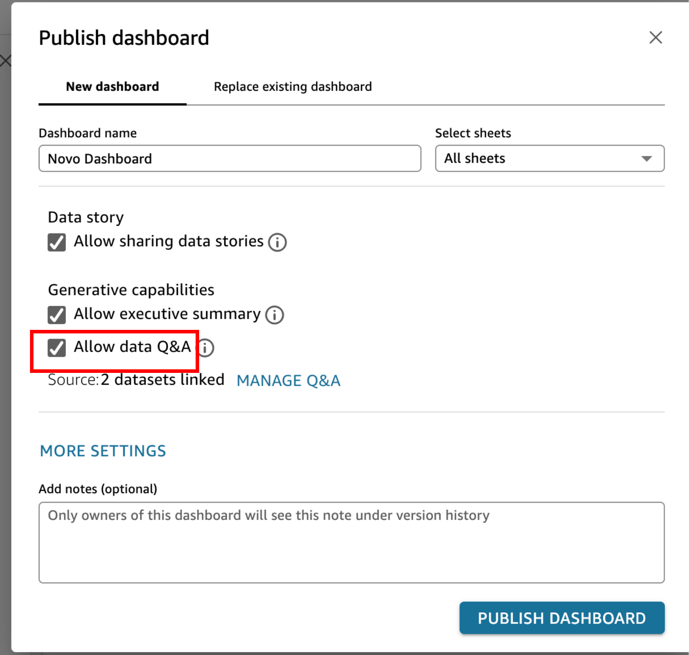

# Instruções sobre o Quicksight
Os passos a seguir mostram como criar dataset, dashboards e usar IA generativa para construir e explorar dados.

## Usando o Athena para explorar dados
o Athena é um serviço de consulta interativo que permite fazer consultas no seu data lake, como o Amazon S3.

1. Vá para a página do [Athena](https://us-east-1.console.aws.amazon.com/athena/home?region=us-east-1#/landing-page).

2. Clique em **Launch query editor**, no botão laranja na tela.

3. Navegue até a aba de **Settings**.

4. Em Setting, clique no botão **Manage**

5. Clique no botão **Browser S3**.

6. Selecione da lista de buckets S3 o único bucket criado na conta, e depois clique em **Choose**

7. No path do seu S3, adicionar `athena-results/`, onde o Athena salvará o resultado de queries. Depois clique no botão **Save**

8. Clique na aba **Editor** como no passo 3. E você já pode fazer consultas.

## Registrando a conta do Quicksight
1- Na console, navegue até o serviço do Quicksight na barra de busca. Você será redirecionado para página de serviço.

2- Insira um email válido para logar no Quicksight. Depois clique em **Continue**

3- Feche a pop up que aparecerá na tela para onde você foi redirecionado no botão **Close**.

## Dando permissão aos datasets
Para acessar os dados é necessário dar permissão ao Quicksight. 

1. No topo direito da página clique em cima do símbolo de uma pessoa.

2. Selecione a opção **Manage Quicksight**.

3. Selecione a opção no menu lateral **Security & Permissions**. E depois, de baixo da seção **IAM role in use** clique em **Manage**.

4. Clique no quadrado ao lado do Amazon S3.

5. No pop up, dê um cheque em todos os quadrados do bucket como na imagem. Depois, clique em **Finish**

6. Repita o mesmo processo para o Athena. Selecione o quadrado ao lado do Amazon Athena.

7. No popup, clique em **Skip**.

8. No final, as caixinhas do Athena e do S3 devem estar com um cheque como na imagem.

9. Clique no topo da página no logo do Quicksight para voltar a **Home**.

## Mudando o tipo de usuário para usar IA generativa
Para usar as todas as capacidades de IA generativa do Quicksight, como construir gráficos com IA, vamos mudar o tipo do nosso usuário atual.

1. No topo direito da página clique em cima do símbolo de uma pessoa.

2. Selecione a opção **Manage Quicksight**.

3. Na nova tela, na frente do email do seu usuário, clique no dropdown onde está a palavra Admin, e selecione agora o **Admin Pro**.

4. Por fim, clique no topo da página no logo do **Quicksight** para retornar a **Home**.

## Criando datasets
Para criar um dataset siga os seguintes passos:

1. Clique em **Datasets**, depois em **New Dataset** 

2. Selecione o **Athena** como dataset.
3. Preencha no pop-up os seguintes valores, e clique em **Create Data source**:
    * Data source name: `athena-datasource`
    * Athena workgroup: primary
    * SSL is enabled

4. Na lista de tabelas e databases, selecione o database criado com o crawler, e a tabela desejada. Depois, clique em **Edit/Preview Data**.

5. Você será redirecionado. Nessa nova tela, você pode: fazer modificações nas colunas, mudar os tipos de dados, excluir colunas. No topo da página, renomeie o dataset para um nome desejado. Para modificar as colunas e o tipo de dados, basta clicar em cima de cada uma delas.

6. Se você quiser fazer join com mais de uma tabela, siga próximos passos. Se você não deseja fazer join entre duas tabelas, siga para o passo 13 dessa seção.

7. Para adicionar mais um dataset para fazer Join, clique no botão **Add Data** no canto superior direito.

8. No pop up que aparecer, selecione no dropdown a opção **Data source**.

9. Selecione o a data source `athena-datasource` criada nos passos anteriores, então clique em **Select**.

10. Selecione da lista as tabelas do Athena que deseja fazer join, depois clique em **Select**.

11. Na tela, clique em cima do símbolo de Join entre os dois datasets (1). Depois, selecione qual a chave de join em **Join clause** entre os dois datasets, você pode usar mais de uma chave (note a opção Add new join clause). Por fim, selecione o **Join type** e clique em **Apply**.

12. Você pode mudar no nome e o tipo das colunas se necessário. Basta clicar em cima da coluna desejada.

13. Mude o nome da sua tabela no topo da página, depois clique em **Save & Publish**. Retorne a página inicial clicando no logo do **Quicksight**.

## Criando sua primeira análise
Uma análise é quando o dashboard está em construção, ainda não foi publicado. Você está na tela de Home. Para retornar a tela de Home a qualquer momento basta clicar no logo do Quicksight no topo da página.

1. No menu lateral clique em **Datasets**.

2. Clique em cima do nome do dataset criado.

3. Na nova tela, clique em **Use in Analysis**.

4. No pop-up, deixe todas as opções padrões, e clique no botão **Create**.

5. Para criar um gráfico basta selecionar o tipo de gráfico desejado (1) e depois as colunas desejadas (2). Para adicionar mais gráficos, você pode usar o botão **Add** (3a) ou **Insert** (3b)

6. Se você quiser, pode mudar algumas características das colunas, como o tipo de agregação. Basta clicar nos três pontos ao lado da coluna.

5. Para modificar o visual, basta clicar no lápis no topo do gráfico.

6. Você pode usar IA generativa para construir gráficos.
    * Aperte o botão **Build Visual** no topo da página.
    * Depois escreva em inglês o que deseja construir. Depois clique em **Build**.
    * Quando o gráfico estiver pronto, clique em **Add to Analysis**.

## Adicionando mais datasets
Se você desejar adicionar mais datasets à análise, siga os passos a seguir.

1. No topo esquerdo da página, clique no dropdown **Dataset**, depois em **Add New dataset**.

2. Selecione da lista o dataset criado nos passos anteriores e clique no botão **Select**.

3. Clique no botão **x** ou **Close** para fechar o pop-up.

4. Para alternar entre datasets, você pode usar o dropdown no topo da página. Selecione o dataset ao qual deseja construir um gráfico, e depois siga o processo normalmente de criar visuais para este dataset.

## Publique um dataset e gere o PDF
Quando tiver terminado as edições nas análises, publique o dashboard.
Você pode repetir este processo de publicação de dashboards quantas vezes for necessário.

1. No topo direito da página, clique em **Publish**.

2. Dê um nome ao seu dashboard. Deixe todas as opções padrões.

3. Cheque o campo **Allow data Q&A**, por padrão ele vem desabilitado.

4. Clique em **Publish Dashboard**.

5. Você será redirecionado para a seguinte tela, onde pode interagir com os gráficos.

6. Para exportar o PDF pra entrega e apresentação do grupo, clique no botão com uma seta no meio como a imagem abaixo. Depois clique na opção **Generate PDF**.

7. No canto superior direito na tela, uma mensagem num retângulo azul dizendo que o PDF começou a ser processado aparecerá **Working on PDF file.** Clique na opção **View Exports**.

8. O PDF leva cerca de alguns segundos ou minutos para ficar pronto. Assim que ele estiver pronto o status será **Your PDF is ready**. Para fazer o download do PDF, você pode clicar no botão **Download** ou na opção **Click to download**.

## Usando IA generativa para descobrir insights
É possível usar a IA generativa para explorar seus dados.

1. Para fazer perguntas aos gráficos, basta clicar no botão do topo **Ask about this dashboard**.

2. Digite, em inglês, a pergunta desejada, e clique no botão **Ask**.
