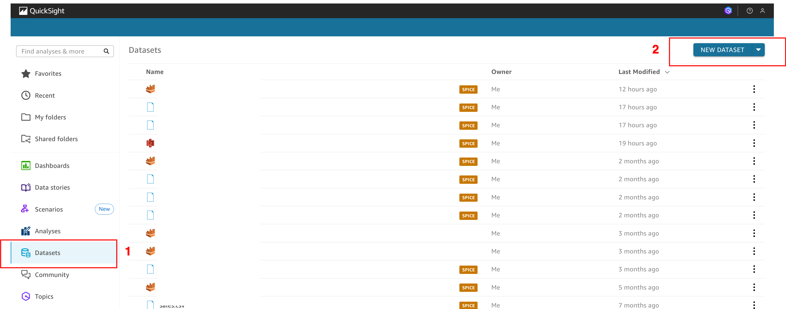
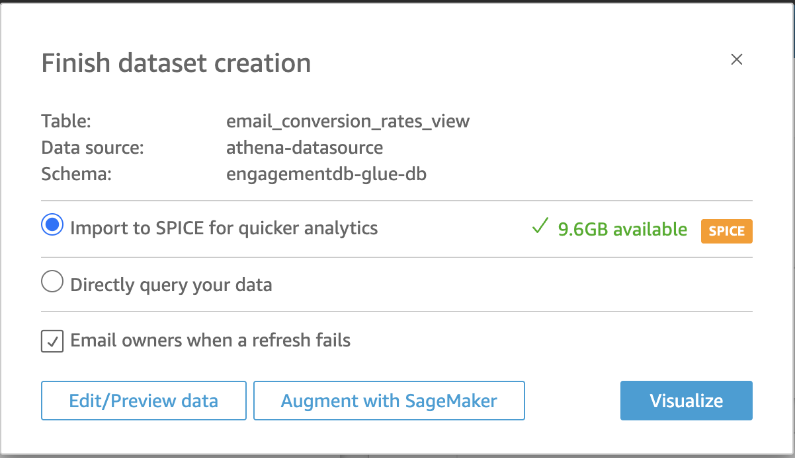
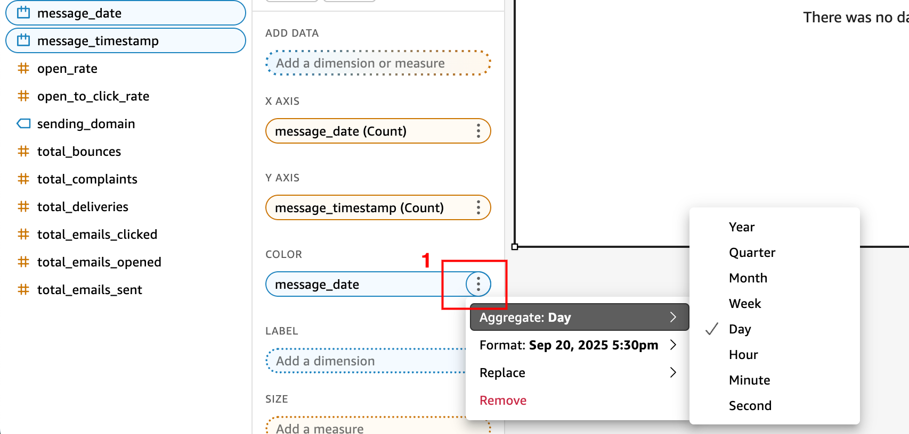
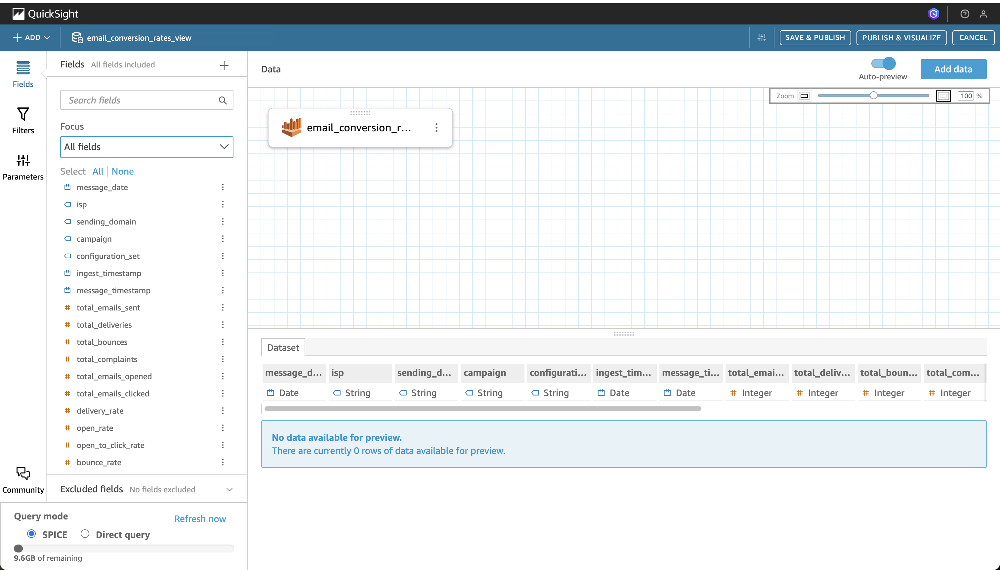
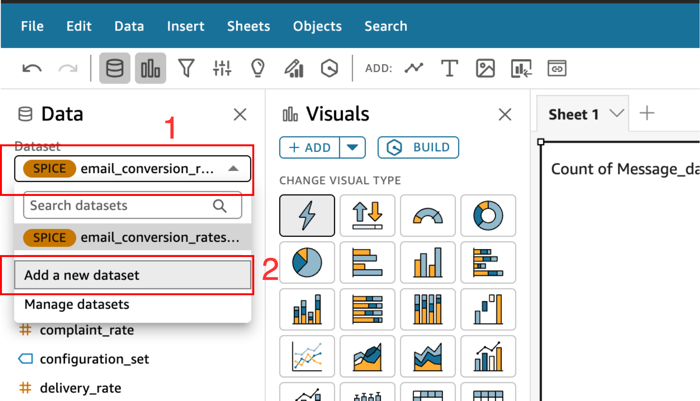
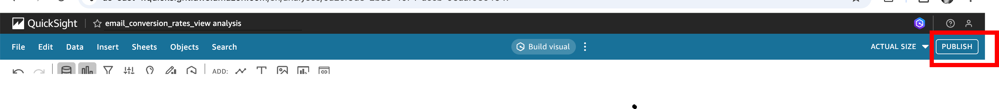
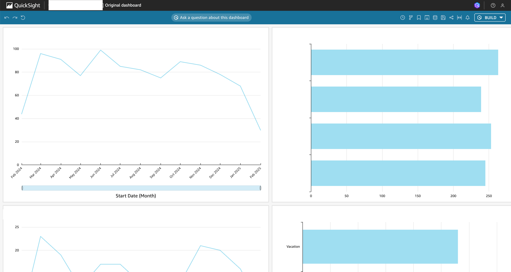
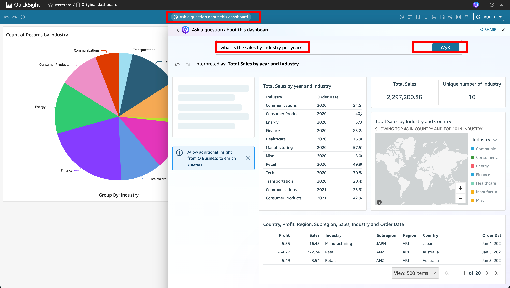

# Instruções sobre o Quicksight
Os passos a seguir mostram como criar dataset, dashboards e usar IA generativa para construir e explorar dados.

## Registrando a conta do Quicksight
1- Na console, navegue até o serviço do Quicksight na barra de busca. Você será redirecionado para página de serviço.

2- Insira um email válido para logar no Quicksight. Depois clique em **Continue**

3- Feche a pop up que aparecerá na tela para onde você foi redirecionado no botão **Close**.

## Criando seu dataset
Para criar um dataset siga os seguintes passos:

1. Clique em **Datasets**, depois em **New Dataset** 

2. Selecione o **Athena** como dataset.
3. Preencha no pop-up os seguintes valores, e clique em **Create Data source**:
    * Data source name: `athena-datasource`
    * Athena workgroup: primary
    * SSL is enabled

4. Na lista de tabelas e databases, selecione o database criado com o crawler, e a tabela desejada. Depois, clique em **Select**

5. Você pode editar o dataset antes de criar um gráfico, mas vamos fazer a criação do gráfico primeiro. Clique em **Visualize**

6. A qualquer momento você pode voltar para home, clicando no logo **Quicksight** no topo superior esquerdo da tela.

## Criando sua primeira análise
Você foi redirecionado para a página de criação de análises. Uma análise é quando o dashboard está em construção, ainda não foi publicado.

1. No pop-up, deixe todas as opções padrões, e clique no botão **Create**.

2. Para criar um gráfico basta selecionar o tipo de gráfico desejado (1) e depois as colunas desejadas (2). Para adicionar mais gráficos, você pode usar o botão **Add** (3a) ou **Insert** (3b).

3. Se você quiser, pode mudar algumas características das colunas, como o tipo de agregação. Basta clicar nos três pontos ao lado da coluna.

4. Para modificar o visual, basta clicar no lápis no topo do gráfico.

5. Você pode usar IA generativa para construir gráficos.
    * Aperte o botão **Build Visual** no topo da página.
    * Depois escreva em inglês o que deseja construir. Depois clique em **Build**.
    * Quando o gráfico estiver pronto, clique em **Add to Analysis**.

## Adicionando mais datasets
Para adicionar mais datasets no seu visual siga os seguintes passos.

1. Clique no logo **Quicksight** no topo esquerdo da página para voltar a Home.

2. Assim como na seção **Criando seu dataset**, clique na aba **Datasets**, depois em **New Dataset**.

3. Selecione o Athena, dê o nome ao datasource como `athena-datasource`. Depois clique em **Create data source**.

4. Selecione o database e a tabela, e então clique em **Edit/Preview Data**.

5. Você será redirecionado. Nessa nova tela, você pode: fazer modificações nas colunas, mudar os tipos de dados, excluir colunas. No topo da página, renomeie o dataset para um nome desejado (1).

6. Selecione o **Spice**, uma espécie de camada de cache para salvar o dataset.

7. Para adicionar mais dataset para fazer **Join**, você pode clicar no botão **Add Data** se quiser.

8. Para finalizar, clique no botão **Save & Publish**.

9. Retorne a Home, clicando no topo esquerdo da página no logo do **Quicksight**.

10. Clique na aba **Analyses**, no menu lateral da página.

11. Clique em cima no nome da Analysis desejada, e ela se abrirá.

12. No topo esquerdo da página, clique no dropdown **Dataset**, depois em **Add New dataset**.

13. Selecione da lista o dataset criado nos passos anteriores e clique no botão **Select**.

14. Clique no botão **x** ou **Close** para fechar o pop-up.

15. Para alternar entre datasets, você pode usar o dropdown no topo da página. Selecione o dataset ao qual deseja construir um gráfico, e depois siga o processo normalmente de criar visuais para este dataset.

## Publique um dataset
Quando tiver terminado as edições nas análises, publique o dashboard.
Você pode repetir este processo de publicação de dashboards quantas vezes for necessário.

1. No topo direito da página, clique em **Publish**.

2. Dê um nome ao seu dashboard. Deixe todas as opções padrões.

3. Cheque o campo **Allow data Q&A**, por padrão ele vem desabilitado.

4. Clique em **Publish Dashboard**.

5. Você será redirecionado para a seguinte tela, onde pode interagir com os gráficos.

## Usando IA generativa para descobrir insights
É possível usar a IA generativa para explorar seus dados.

1. Para fazer perguntas aos gráficos, basta clicar no botão do topo **Ask about this dashboard**.

2. Digite, em inglês, a pergunta desejada, e clique no botão **Ask**.
