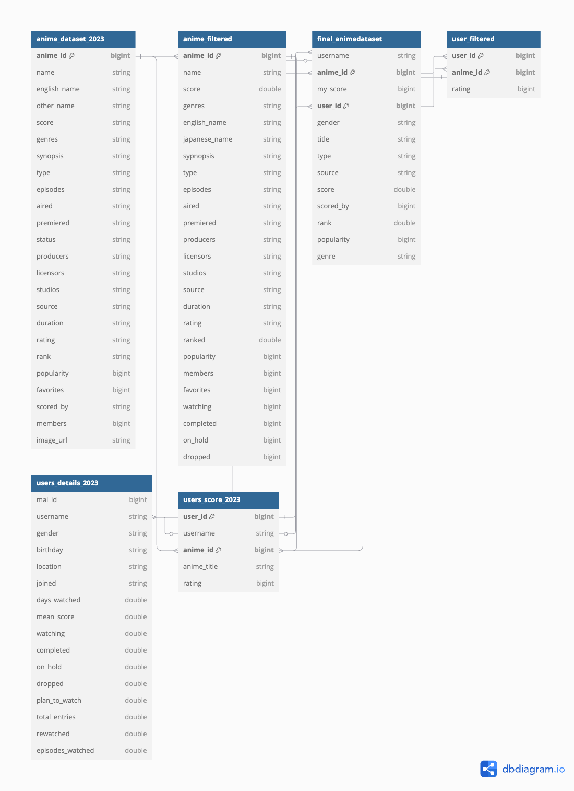

# Dicionário de Dados Estratégico para Análise de Mercado de Animes  

## Introdução
Este dicionário de dados foi elaborado para fornecer uma visão abrangente e estratégica dos dados disponíveis na plataforma [FIAP-Animes](https://www.kaggle.com/datasets/dbdmobile/myanimelist-dataset/data), com foco em animes. O objetivo é facilitar a análise e interpretação dos dados, permitindo que as equipes de marketing, desenvolvimento de produto e aquisição de conteúdo possam tomar decisões informadas e estratégicas.
Lembrando que os dados originais em CSV já foram limpos e convertidos em parquet para facilitar o uso no Amazon Athena.
A seguir, apresentamos as tabelas disponíveis, suas descrições e aplicações estratégicas.

## Tabelas Disponíveis

## 1. Tabela: anime_dataset_2023  
**Descrição:** Tabela completa com informações detalhadas sobre animes, incluindo dados de popularidade, classificação e características gerais.  

| Coluna           | Tipo    | Comentário de Negócio                                                                 |
|-------------------|---------|---------------------------------------------------------------------------------------|
| anime_id          | bigint  | Identificador único do anime, usado para cruzamento com outras tabelas e tracking individual. |
| name              | string  | Nome original do anime, utilizado como principal referência no catálogo.              |
| english_name      | string  | Nome internacionalizado do título, importante para análise de mercado global.         |
| other_name        | string  | Nomes alternativos usados em diferentes regiões, úteis para localização e marketing.  |
| score             | string  | Média de avaliações dos usuários (0-10), indicador de qualidade percebida.            |
| genres            | string  | Gêneros associados ao anime (ex: Action, Romance), usados para segmentação e análise de tendências. |
| synopsis          | string  | Sinopse narrativa do anime, útil para análise temática e campanhas promocionais.      |
| type              | string  | Formato de mídia (TV, Movie, OVA), define estratégias de distribuição e consumo.       |
| episodes          | string  | Número total de episódios disponíveis, importante para análise de engajamento e custo-benefício. |
| aired             | string  | Período de exibição original, usado para estudos sazonais e planejamento estratégico. |
| premiered         | string  | Temporada de estreia (ex: Winter 2023), relevante para calendário de lançamentos.     |
| status            | string  | Status atual do anime (Concluído, Em andamento), usado para gestão do catálogo.       |
| producers         | string  | Lista de produtoras responsáveis pelo conteúdo, útil para análise de parcerias estratégicas. |
| licensors         | string  | Empresas licenciadoras que distribuem o anime, usadas para expansão geográfica e compliance legal. |
| studios           | string  | Estúdios responsáveis pela produção, relevantes para avaliação da qualidade técnica e artística. |
| source            | string  | Origem do material (Mangá, Light Novel), usado para aquisição de IPs promissores e identificação de tendências. |
| duration          | string  | Duração média por episódio, útil para otimização de grades de programação.            |
| rating            | string  | Classificação etária (ex: PG-13), utilizada em estratégias regulatórias e targeting demográfico. |
| rank              | string  | Posição no ranking geral do MyAnimeList, usada como benchmark competitivo.            |
| popularity        | bigint  | Indicador da demanda atual entre os usuários da plataforma, essencial para priorização estratégica. |
| favorites         | bigint  | Número total de usuários que marcaram o anime como favorito, indicador de fidelidade da audiência. |
| scored_by         | string  | Quantidade total de avaliações recebidas pelo anime, importante para confiabilidade estatística das notas. |
| members           | bigint  | Total de membros que interagem com o anime na plataforma, métrica essencial para alcance global. |
| image_url         | string  | URL da imagem promocional do anime, usada em campanhas visuais e branding estratégico. |

---

### **Aplicações Estratégicas:**  
1. **Segmentação por Gênero:**  
   - Usar `genres` para identificar tendências populares entre diferentes públicos-alvo.

2. **Priorização de Marketing:**  
   - Cruzar `popularity` com `favorites` para alocar recursos promocionais nos títulos mais promissores.

3. **Análise Sazonal:**  
   - Utilizar `aired` e `premiered` para planejar relançamentos ou campanhas sazonais.

4. **Benchmark Competitivo:**  
   - Comparar `rank` e `score` entre diferentes animes para avaliar performance relativa no mercado.

5. **Expansão Geográfica:**  
   - Usar `licensors` e `english_name` para identificar oportunidades em mercados internacionais.

6. **Otimização do Catálogo:**  
   - Analisar `episodes`, `duration`, e `completed` em outras tabelas para ajustar formatos ao consumo.

Este catálogo fornece uma visão abrangente dos dados relacionados aos animes na plataforma MyAnimeList, permitindo análises voltadas à retenção, engajamento e expansão estratégica.

## Catálogo da Tabela: **anime_filtered**  
**Descrição:** Dados refinados para análise comparativa de animes com métricas estratégicas de engajamento  

| Coluna           | Tipo    | Comentário de Negócio                                                                 |
|-------------------|---------|---------------------------------------------------------------------------------------|
| anime_id          | bigint  | Identificador único para cruzamento com outras tabelas e tracking individual          |
| name              | string  | Título original em japonês (base para identificação no mercado doméstico)             |
| score             | double  | Nota média (0-10) padronizada - principal KPI de qualidade percebida                   |
| genres            | string  | Mix de gêneros (ex: Sci-Fi+Romance) para identificação de subnichos de mercado         |
| english_name      | string  | Nome internacionalizado - análise de penetração em mercados anglófonos                |
| japanese_name     | string  | Nome nativo para comparação com dados de audiência local                               |
| sypnopsis         | string  | Sinopse editorial - base para análise de temas via NLP em campanhas                   |
| type              | string  | Formato de mídia (TV/OVA/Movie) - define estratégias de distribuição                   |
| episodes          | string  | Número total de episódios - cálculo de custo de produção vs retenção                  |
| aired             | string  | Período de exibição original - análise de sazonalidade e relançamentos                |
| premiered         | string  | Temporada de estreia (ex: Winter 2023) - planejamento de calendário de lançamentos    |
| producers         | string  | Lista de produtoras - identificação de parcerias estratégicas bem-sucedidas           |
| licensors         | string  | Distribuidores licenciados - análise de expansão geográfica                           |
| studios           | string  | Estúdios de animação - benchmark de qualidade técnica e artística                     |
| source            | string  | Origem do material (Mangá/Web Novel) - priorização de IPs com potencial               |
| duration          | string  | Duração por episódio - otimização de grades de programação                            |
| rating            | string  | Classificação etária (ex: R-17) - compliance regulatório e targeting                  |
| ranked            | double  | Posição no ranking filtrado - monitoramento de performance relativa                   |
| popularity        | bigint  | Índice de demanda atual - priorização de investimentos em marketing                   |
| members           | bigint  | Total de usuários na comunidade - medição de alcance bruto                            |
| favorites         | bigint  | Número de favoritos - indicador de fidelização da base fã                             |
| watching          | bigint  | Usuários ativamente engajados - medição de hype momentâneo                            |
| completed         | bigint  | Conteúdos totalmente consumidos - cálculo de taxa de conclusão                        |
| on_hold           | bigint  | Audiência em pausa - detecção de problemas de retenção                                |
| dropped           | bigint  | Rejeições explícitas - identificação de conteúdos com baixa aceitação                 |

**Aplicações Estratégicas:**  
1. Cruzar `genres` + `watching` para detectar gêneros em ascensão  
2. Usar `ranked` vs `popularity` para identificar "hidden gems" do catálogo  
3. Analisar `dropped` + `duration` para ajustar formato dos lançamentos  
4. Combinar `producers` + `score` para priorizar parcerias lucrativas  
5. Usar `premiered` + `completed` para prever tendências de consumo por temporada

## 3. Tabela: final_animedataset  
**Descrição:** Tabela que relaciona usuários e animes, contendo informações sobre preferências, avaliações e dados demográficos.  

| Coluna           | Tipo    | Comentário de Negócio                                                                 |
|-------------------|---------|---------------------------------------------------------------------------------------|
| username          | string  | Nome de usuário na plataforma, usado para identificação de padrões individuais.       |
| anime_id          | bigint  | Identificador único do anime, essencial para cruzamento com outras tabelas.           |
| my_score          | bigint  | Nota atribuída pelo usuário ao anime (0-10), útil para personalização de recomendações.|
| user_id           | bigint  | Identificador único do usuário, usado para análise demográfica e comportamental.      |
| gender            | string  | Gênero declarado pelo usuário, relevante para segmentação de público-alvo.            |
| title             | string  | Nome do anime avaliado pelo usuário, usado para análise de preferências específicas.   |
| type              | string  | Formato do anime (TV, Movie, OVA), útil para entender o consumo por tipo de mídia.     |
| source            | string  | Origem do conteúdo (Mangá, Light Novel), relevante para identificar tendências de IPs. |
| score             | double  | Média de avaliações gerais do anime, usada como indicador de qualidade percebida.      |
| scored_by         | bigint  | Número total de usuários que avaliaram o anime, importante para confiabilidade estatística.|
| rank              | double  | Posição no ranking geral do anime, usada como benchmark competitivo.                   |
| popularity        | bigint  | Indicador de demanda do anime entre os usuários da plataforma.                        |
| genre             | string  | Gêneros associados ao anime (ex: Action, Romance), usados para segmentação e análise de tendências.|

---

### **Aplicações Estratégicas:**  
1. **Personalização de Recomendação:**  
   - Usar `my_score` e `genre` para criar sistemas personalizados que sugerem animes com base nas preferências individuais dos usuários.

2. **Segmentação Demográfica:**  
   - Cruzar `gender` com `type` e `source` para identificar padrões de consumo por gênero e origem do conteúdo.

3. **Análise de Popularidade:**  
   - Utilizar `popularity`, `score`, e `rank` para priorizar investimentos em marketing nos animes mais promissores.

4. **Identificação de Nichos:**  
   - Explorar `genre` e `scored_by` para detectar subgêneros ou categorias emergentes com potencial de crescimento.

5. **Benchmark Competitivo:**  
   - Comparar `rank` e `popularity` entre diferentes animes para avaliar a performance relativa no mercado.

Este catálogo fornece informações detalhadas que permitem análises estratégicas voltadas à retenção de público, otimização do catálogo e identificação de oportunidades no mercado de animes.
 

## 4. Tabela: user_filtered  
**Descrição:** Tabela que registra a avaliação do usuário a cada vez que assiste o anime e avaliou.  

| Coluna    | Tipo   | Comentário de Negócio                                                                 |
|-----------|--------|---------------------------------------------------------------------------------------|
| user_id   | bigint | Identificador único do usuário, usado para análise comportamental e cruzamento com dados demográficos. |
| anime_id  | bigint | Identificador único do anime, essencial para relacionar interações com dados do catálogo de animes. |
| rating    | bigint | Nota atribuída pelo usuário ao anime (0-10), usada para avaliar preferências e qualidade percebida. |

---

### **Aplicações Estratégicas:**  
1. **Personalização de Recomendação:**  
   - Usar `rating` e `anime_id` para criar sistemas de recomendação baseados nas avaliações individuais dos usuários.

2. **Análise de Engajamento:**  
   - Cruzar `user_id` com dados demográficos de outras tabelas para entender padrões de consumo por segmento.

3. **Identificação de Tendências:**  
   - Analisar as notas (`rating`) atribuídas aos animes mais populares para prever tendências futuras no mercado.

4. **Benchmark de Qualidade:**  
   - Comparar as notas médias dos usuários com os dados gerais do catálogo (`anime_filtered`) para identificar discrepâncias ou oportunidades de melhoria.

## 5. Tabela: users_details_2023  
**Descrição:** Tabela com informações detalhadas sobre os usuários, incluindo dados demográficos e hábitos de consumo de animes.  

| Coluna            | Tipo    | Comentário de Negócio                                                                 |
|--------------------|---------|---------------------------------------------------------------------------------------|
| mal_id            | bigint  | Identificador único do usuário na plataforma MyAnimeList, usado para cruzamento de dados. |
| username          | string  | Nome de usuário na plataforma, utilizado para análises comportamentais e engajamento. |
| gender            | string  | Gênero declarado pelo usuário, relevante para segmentação e targeting demográfico.     |
| birthday          | string  | Data de nascimento do usuário, usada para análise etária e criação de personas.       |
| location          | string  | Localização geográfica do usuário, importante para estratégias regionais de marketing. |
| joined            | string  | Data em que o usuário se registrou na plataforma, útil para análises de retenção.      |
| days_watched      | double  | Total de dias que o usuário dedicou ao consumo de animes, indicador de engajamento.    |
| mean_score        | double  | Nota média atribuída pelo usuário aos animes, usada para identificar críticos influentes. |
| watching          | double  | Número de animes que o usuário está assistindo atualmente, indicador de engajamento ativo. |
| completed         | double  | Total de animes que o usuário concluiu, útil para medir a taxa de consumo completo.    |
| on_hold           | double  | Número de animes que o usuário colocou em pausa, indicador de possíveis problemas de retenção. |
| dropped           | double  | Total de animes abandonados pelo usuário, usado para identificar conteúdos com baixa aceitação. |
| plan_to_watch     | double  | Número de animes que o usuário pretende assistir no futuro, útil para prever demanda futura. |
| total_entries     | double  | Total geral de entradas no perfil do usuário (assistidos, pausados, etc.), indicador do nível de atividade. |
| rewatched         | double  | Número total de vezes que o usuário reassistiu animes, usado para identificar conteúdos evergreen. |
| episodes_watched  | double  | Total acumulado de episódios assistidos pelo usuário, métrica importante para medir engajamento geral. |

---

### **Aplicações Estratégicas:**  
1. **Análise Demográfica:**  
   - Cruzar `gender` e `location` com hábitos (`days_watched`, `completed`) para segmentar campanhas regionais e por público-alvo.

2. **Previsão de Demanda:**  
   - Utilizar `plan_to_watch` como indicador das preferências futuras dos usuários e priorizar lançamentos.

3. **Identificação de Usuários Influentes:**  
   - Analisar `mean_score` e `rewatched` para identificar usuários altamente engajados ou críticos influentes.

4. **Retenção e Engajamento:**  
   - Monitorar `on_hold` e `dropped` para detectar padrões ou problemas em conteúdos específicos.

5. **Otimização do Catálogo:**  
   - Cruzar `episodes_watched` com dados dos animes (`anime_filtered`) para entender quais formatos geram maior engajamento.

Este catálogo fornece uma visão completa das interações dos usuários com a plataforma e seus hábitos de consumo, permitindo análises estratégicas voltadas à retenção, personalização e expansão.
 

## 6. Tabela: users_score_2023  
**Descrição:** Tabela que registra o histórico detalhado de avaliações dos usuários sobre os animes, permitindo análises de preferências individuais e padrões de consumo.  

| Coluna        | Tipo    | Comentário de Negócio                                                                 |
|---------------|---------|---------------------------------------------------------------------------------------|
| user_id       | bigint  | Identificador único do usuário, usado para cruzamento com outras tabelas e análise comportamental. |
| username      | string  | Nome de usuário na plataforma, utilizado para identificar padrões de avaliação e engajamento. |
| anime_id      | bigint  | Identificador único do anime avaliado, essencial para relacionar interações com o catálogo de animes. |
| anime_title   | string  | Nome do anime avaliado pelo usuário, usado para análise de preferências específicas e identificação de títulos populares. |
| rating        | bigint  | Nota atribuída pelo usuário ao anime (0-10), usada para medir qualidade percebida e preferências individuais. |

---

### **Aplicações Estratégicas:**  
1. **Personalização de Recomendação:**  
   - Usar `rating` e `anime_title` para criar sistemas personalizados que sugerem animes com base nas avaliações dos usuários.

2. **Identificação de Títulos Populares:**  
   - Cruzar `anime_id` com dados de popularidade em outras tabelas para identificar os animes mais bem avaliados pelos usuários.

3. **Análise de Preferências Individuais:**  
   - Utilizar `username` e `rating` para entender os gostos específicos dos usuários e segmentar campanhas promocionais.

4. **Detecção de Tendências:**  
   - Monitorar as notas (`rating`) atribuídas aos animes ao longo do tempo para prever mudanças nas preferências do público.

5. **Benchmark de Qualidade:**  
   - Comparar as avaliações (`rating`) dos usuários com as médias gerais dos animes (`score` em outras tabelas) para identificar discrepâncias ou oportunidades de melhoria.

Este catálogo é essencial para análises voltadas à personalização, retenção e otimização da experiência do usuário na plataforma.
 

## Aplicações Estratégicas por Domínio  

### Aquisição de Conteúdo  
- Cruzar `genres` (anime_dataset_2023) com `plan_to_watch` (users_details_2023) para identificar gaps no catálogo  
- Analisar `studios` vs `score` para priorizar parcerias com estúdios de alta performance  

### Engajamento de Usuários  
- Utilizar `days_watched` e `rewatched` para desenvolver programas de fidelidade  
- Combinar `gender` com `genre` preferidos para campanhas personalizadas  

### Desenvolvimento de Produto  
- Correlacionar `duration` com `completed` para otimizar formato de episódios  
- Usar `sypnopsis` em modelos de NLP para sugerir novas premissas narrativas  

### Expansão de Mercado  
- Cruzar `licensors` com `location` dos usuários para estratégias de licensing  
- Analisar `english_name` vs popularidade em regiões não-asiáticas  

Este dicionário permite:  
1. Identificar conteúdos subutilizados (`favorites` vs `members`)  
2. Prever sucessos antes do lançamento (`plan_to_watch` + `producers`)  
3. Otimizar investimentos em produção (`duration` vs `completed`)  
4. Personalizar experiências (`my_score` histórico + `gender`)